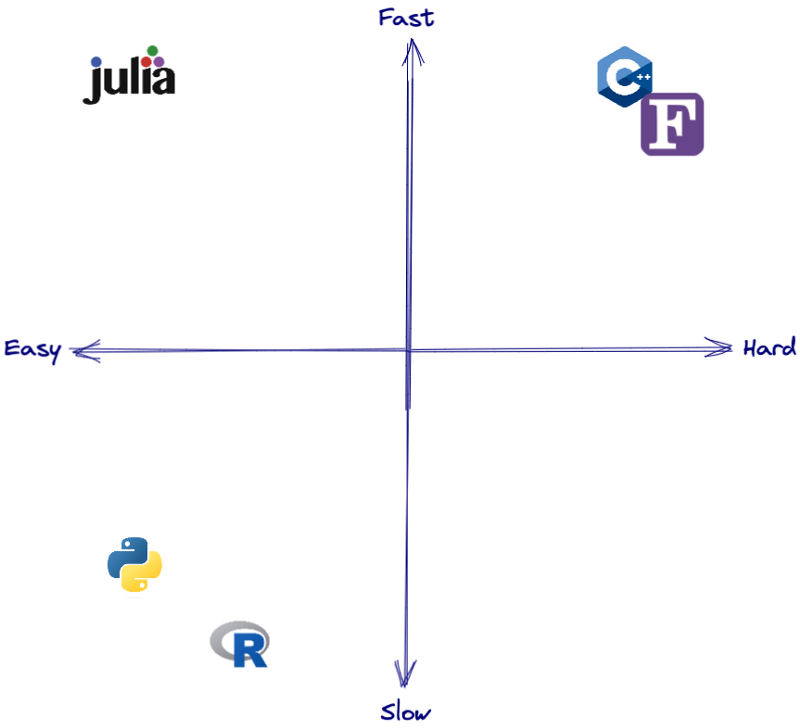

# Improving Computation Speed of PyCausality Library for Large Datasets

## Introduction
In social science research, the notion of causality has been the main question when analyzing datasets. There has been rich research in causal inference using linear and non-linear models, but it is mostly analysis on whether and how much a dataset might have had influence in the outcome of a target factor. For predicting whether a data will cause another dataset, the methodology has been long debated. Furthermore, a simulation of behavior of groups when increased in interaction has become important in analyzing the real-world society. In both cases, one of the major methodologies is by using the information theory-based measurement.

In terms of causality, the most favorable and basic way of estimation is by using the instrumental variable method (IV). However, when given a time-series like data, how much the history of one dataset would likely to have caused the history of another dataset has been hard to estimate using the method. One of the early approaches in devising the method is from Granger (1969). Following his name, this method was called the Granger Causality. His main idea was based on the fact that effect cannot precede the cause and that there is some influence from cause to effect.  However, this methodology has been in debate, due to misunderstandings to the general public and since it is difficult to differentiate whether one has caused or has been caused for highly interrelated dataset. 
Due to these difficulties, another method called transfer entropy has been proposed by Schreiber (2000) to measure the causality based on the change in information compared to the past. His approach uses the Shannon entropy measure to estimate the information gain from the past to the present data. Comparing two datasets $Y_t, X_t$, transfer entropy compares the entropy change (what he calls the information gain) of $Y_t$ given the k-lagged past $\{Y_{t-k},…\}$ or given the k-lagged and l-lagged past $\{Y_{t-k},…, X_{t-l},…\}$. Comparing the two values, whether the l-lagged past of X has caused the current state of Y by information transfer can be estimated.

Another information theory measure called mutual information is also based on Shannon’s entropy. On contrary to transfer entropy, mutual information does not care the information gain caused by the past, but it only measures the shared amount of information between two data and can be though as a generalized correlation measure. It has been used as a measure to quantify dependency or to simulate how a society changes after interaction (Kemp and Bettencourt, 2023).

Although the above measures have been originally derived from electrical engineering, and is mostly used the engineering field, social science researchers have been increasingly using the measures as well. Especially, since transfer entropy can estimate the causality of a time series data, the usage of the model has been increased in financial and the economic field (Marschinski and Kantz, 2002; Kim et. al, 2013; Choi, Yun and Kim, 2022). Moreover, since it is based on information theory, the use has also been analyzing social media data to analyze the information transfer between users (Mendoza et.al, 2021; Borge-Holthoefer et. al, 2016). Combination of network analysis method with the transfer entropy has also been used to model the real-world relationship as well (Choi, Yun and Kim, 2022; Kim et.al 2016; Cao, Zhang and Li, 2017).

## Significance
There has been attempts to calculate the information theory measures by computation. One of the widely used library is *RTransferEntropy*, which is implemented in *R*. Moreover, there recently has been an implementation to *Julia* programming language, called *TransferEntropy.jl*. *R* is a popular statistical programming language and has many statistical related libraries. *Julia* is a recent programming language focused at generating a computation speed close to *C*. However, regardless of its popularity and variety of packages, *R* is relatively slow in computation speed and is low in popularity for research other than computation. While *Julia* is fast and the syntax is similar to *Python*, it is low in popularity and the libraries and documentation are insufficient due to it being relatively new. Therefore, it is reasonable to implement the calculation method in *Python*, since it is popular in general computation research, and can be increased in computation speed using *numba, mpi*, or cloud computing. 

[Performance comparison between computation languages](https://juliadatascience.io/julia_accomplish.html#:~:text=The%20petaflop%20club%20is%20comprised,belong%20to%20the%20petaflop%20club.)


However, one problem with calculating the information theory measures is that the computation time is extremely slow, even though the dataset is small. This is due to the measures using $2*n(n-1)$ number of subdatasets, and estimating the probability density function for each subdatasets, increasing the computation speed exponentially as data size increases. For instance, given a dataset with size KxN, the total number of subsets are $2N(N-1)$ and the data used for PDF estimation is $3*(K-lag)$: for $\{Y_t\}, \{Y_{t-k}}\, \{X_{t-l}}\ $. Therefore, using the large-scale computation methods as discussed in the course would be optimal for increasing the computation speed and optimizing the performance of calculating the information theory-based measures.

One package that has implemented information theory causality measure is *PyCausality* by Zac Keskin, which has been implemented for his PhD dissertation. This package is extremely slow due to its implementation and calculation mainly based on *pandas*, which is known for its slow computation speed. For instance, a single dataset for the size 125x350 is known to have taken more than 10 hours (Yun, 2022). In this end, this project aims to increase the efficiency of the “PyCausality” library by implementing *numpy, numba* and *mpi4py* when possible. For the module that calculates Granger causality, I implemented numba and mpi, and for transfer entropy, I implemented mpi. Moreover, for simplicity, this project would only use gaussian kernel density estimator and discard rolling window calculation methods, in contrast to the original library.

## Performance
The performance testing would be performed on two datasets. First, the test data which is presented in the original package. Second the ‘return_pre_brexit.csv’ data, which is the exchange rate data for 36 countries from Jan 2016 to Jun 2016.
1. Using the *test_data.csv*
* The performance for calculating Granger causality 
* Performance from converting to *numpy and numba* using the %timeit magic function at single core, with number of shuffles 20 and single sub dataset.
	* Original: 165 ms ± 2.26 ms per loop (mean ± std. dev. of 7 runs, 10 loops each)
* This Project: 2.93 ms ± 23.2 µs per loop (mean ± std. dev. of 7 runs, 100 loops each)
	* Performance using MPI module.
		* Original: 
		* This Project: 
* The performance for calculating Transfer Entropy
	* Performance using MPI module.
		* Original
		* This Project
2. Using the *return_pre_brexit.csv*
* The performance for calculating Granger causality
	* Performance from converting to *numpy and numba* using the %timeit magic function at single core, with number of shuffles 20 and single sub dataset.
		* Original: 330 ms ± 4.09 ms per loop (mean ± std. dev. of 7 runs, 1 loop each)
		* This Project: 1.07 ms ± 2.15 µs per loop (mean ± std. dev. of 7 runs, 1,000 loops each)

## Running the Code
1. To test only the single core and single sub dataset numba usage and 20 shuffles.
```python
from lag_data_gen import LaggedTimeSeriesArray
import pandas as pd
import numpy as np

lts_df = LaggedTimeSeriesArray(data[[‘column1’, ‘column2’]], lag=2).df
GrangerCausality(brex_lts_df, ‘column1’, ‘column2’, lag=2).Granger_Caus(n_shuffles=20).transpose()
```
2. To run this package in an MPI framework:
```bash
#!/bin/bash

#SBATCH --job-name=Fin_project
#SBATCH --ntasks=6
#SBATCH -o Fin_project.out
#SBATCH -e Fin_project.out
#SBATCH --open-mode truncate
#SBATCH --partition=broadwl
#SBATCH --constraint=fdr
#SBATCH --account=macs30123

# Load Python and MPI modules
module load python/anaconda-2019.03
module load intelmpi/2018.2.199+intel-18.0

python granger_pycc.py
# Run the python program with mpirun, using & to run jobs at the same time
mpirun -n 6 python mpi_job.py
```
* The *granger_pycc.py* pre-compiles the numba code for calculating Granger causality.
* For optimal efficiency, the cores to use for MPI jobs should be able to be divided by the number of columns.

3. To change the dataset and calculation method
In the python file *mpi_job.py*
```python
if __name__ == "__main__":
    data_name = 'test_data'
    data = pd.read_csv(f'{data_name}.csv').iloc[:,1:]
    comb_list = [combs for combs in combinations(data.columns, 2)]
    comb_bi_name = gen_comb_bi_name(comb_list)
    data_comb_list = np.array([data[[comb_list[i][0], comb_list[i][1]]].to_numpy() for i in range(len(comb_list))])
    lag = 1
    method = 'transfer_entropy'
    mpi_work(data_name, data, comb_list, comb_bi_name, data_comb_list, lag, method)
```
The variables *data_name* is the path to the file, and *method* is one of [‘transfer_ent’, ‘granger’, ‘mutual_inf’].

## Reference
* Kemp, Jordan T., and Luís MA Bettencourt. "Learning increases growth and reduces inequality in shared noisy environments." PNAS nexus 2, no. 4 (2023): pgad093.
* Marschinski, Robert, and Holger Kantz. "Analysing the information flow between financial time series: An improved estimator for transfer entropy." The European Physical Journal B-Condensed Matter and Complex Systems 30 (2002): 275-281.
* Kim, Jinkyu, Gunn Kim, Sungbae An, Young-Kyun Kwon, and Sungroh Yoon. "Entropy-based analysis and bioinformatics-inspired integration of global economic information transfer." PloS one 8, no. 1 (2013): e51986.
* Harré, Michael., Lizier, Joseph T.., Barnett, Lionel., Bossomaier, Terry. An Introduction to Transfer Entropy: Information Flow in Complex Systems. Germany: Springer International Publishing, (2016).
* Granger, Clive WJ. "Investigating causal relations by econometric models and cross-spectral methods." Econometrica: journal of the Econometric Society (1969): 424-438
* Schreiber, Thomas. "Measuring information transfer." Physical review letters 85, no. 2 (2000): 461.
* Choi, Insu, Wonje Yun, and Woo Chang Kim. "Improving data efficiency for analyzing global exchange rate fluctuations based on nonlinear causal network-based clustering." Annals of Operations Research (2022): 1-36.
* Mendoza Urdiales, Román Alejandro, Andrés García-Medina, and José Antonio Nuñez Mora. "Measuring information flux between social media and stock prices with Transfer Entropy." Plos one 16, no. 9 (2021): e0257686.
* Borge-Holthoefer, Javier, Nicola Perra, Bruno Gonçalves, Sandra González-Bailón, Alex Arenas, Yamir Moreno, and Alessandro Vespignani. "The dynamics of information-driven coordination phenomena: A transfer entropy analysis." Science advances 2, no. 4 (2016): e1501158
* Cao, Guangxi, Qi Zhang, and Qingchen Li. "Causal relationship between the global foreign exchange market based on complex networks and entropy theory." Chaos, solitons & fractals 99 (2017): 36-44.
* Yun, Wonje. “Analysis Framework of Dependency Measures in the Stock Market, and its Applications”(Master’s Thesis, Korea Advanced Institute of Science and Technology), 53.
